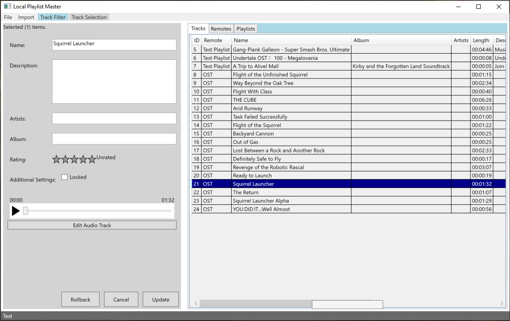
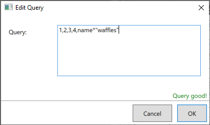
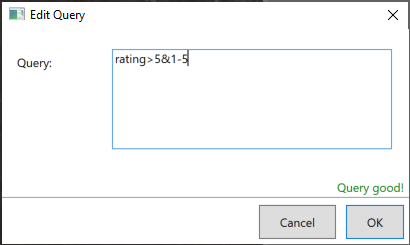

# Local Playlist Master
A set of tools and a GUI to manage a locally hosted music database.

- Quickly import YouTube music playlists and concert YouTube videos with chapters.
- Trim beginning/end and adjust volume of clips in app.
- Export playlist files to run on most audio players.
- Edit track metadata (title, album, etc.)
- Perform queries to quickly create playlists with specific criteria.
- Divide concerts into their seperate tracks.

---
# Import Options

In order to import tracks into the database, you must add a remote. A remote is a collection of tracks of the same origin.

To add a remote, go to the remotes tab and right click and hit add. Give the remote a link and type to grab from.

### Types of Remotes
- YouTube / web video playlist (yt-dlp)
- YouTube / web video concert (yt-dlp)
- Local folder

Playlists require the url to be a playlist. Concerts require a single video with or without chapters.

Remotes using yt-dlp as a backend can import from any website that [yt-dlp supports](https://github.com/yt-dlp/yt-dlp/blob/master/supportedsites.md).

---

# How to query
Querying can be used to search for specific tracks in the GUI or to create a playlist.
### Searching / Filtering
Click on track filter on the toolbar and edit filter. This allows you to display only the tracks you want to see.
### Creating and Editing Playlists
Go to the playlist menu and right click to add a playlist. Then afterwards select the playlist and edit the track selection.
### Query Syntax

In this example, tracks with the ids 1, 2, 3, and 4 are added. Also, any track with a name that contains the string "waffles" inside will be added.

        QUERYABLES:
        id (implicit)                   int
        remote                          int
        name                            string
        artists                         string
        album                           string
        description                     string
        rating                          int
        time                            int

        OPERATORS:
        =   equals
        !=  not equals
        ^   starts with                 string only
        !^  does not start with         string only
        $   ends with                   string only
        !$  does not end with           string only
        *   contains                    string only
        !*  does not contain            string only
        <   less than                   int only
        >   greater than                int only
        <=  less than or equal to       int only
        >=  greater than or equal to    int only
        :   is between                  int only
        -   between and                 int only
        &   and (another term)

        Commas act as a seperate section which are ored together.
        Quotes inside values are parsed as strings, \" and \\ can be used.
        Everything is case insensitive.
        Whitespace outside of quotes is ignored.